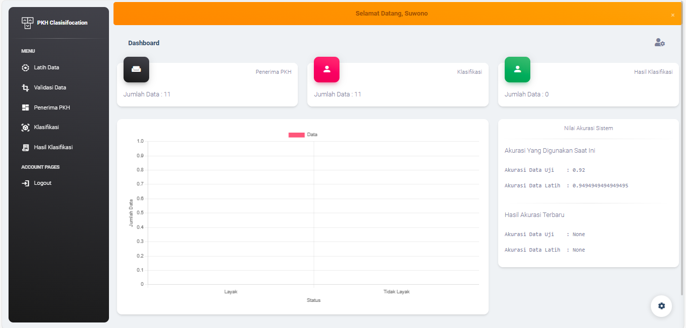
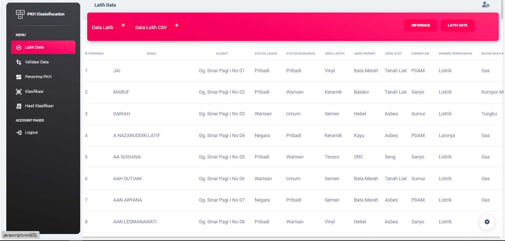
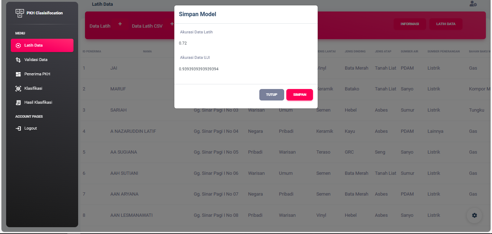
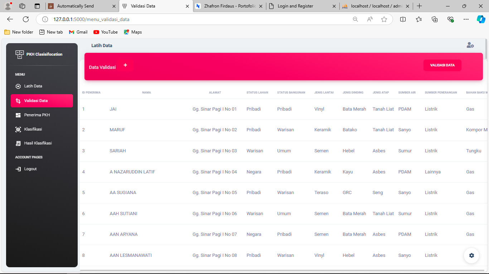
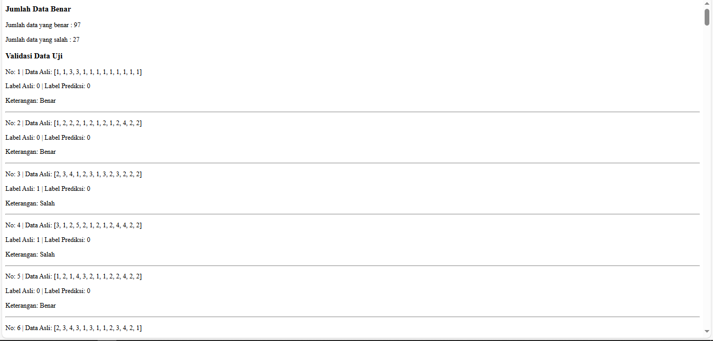
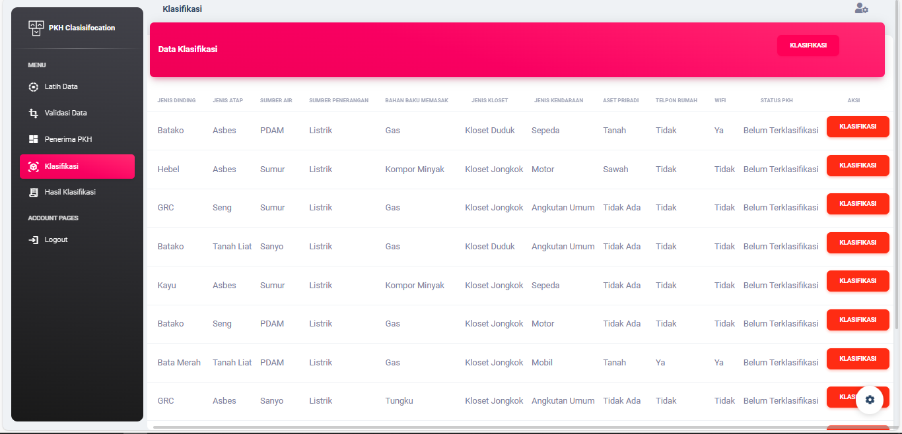
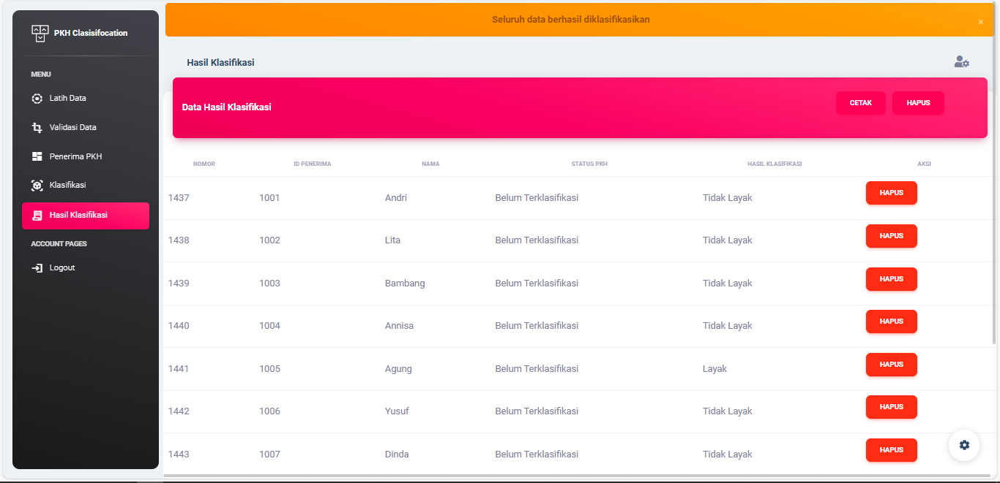

# Classification

This project is a capstone project that is based on a real case study in my area. This program is an implementation of deep learning AI using Artificial Neural Network algorithm which is PKH social assistance classification.

## Tech Stack

**CSS Framework:** Boostrap, Modal

**API Server:** PyMySQL

**Web Side:** HTML CSS, Javascript, Python

**Python Framework:** Flask, SKLearn, Matplotlib, Pickle, Numpy

## Roadmap

- Browser support

- Data Testing

- Data Training

- Classification

- Final result

## Features

- Diagram result Classification
- Currently Train and Test data are used
- Training and Testing New Dataset
- Connected into DB

## Screenshots

#### - Dashboard

#### - Menu Data Train

#### - Training Data

#### - Data Test Menu

#### - Testing Data

#### - Classification Menu

#### - Classification

## Support

For support, email zhofronfirdaus@gmail.com

